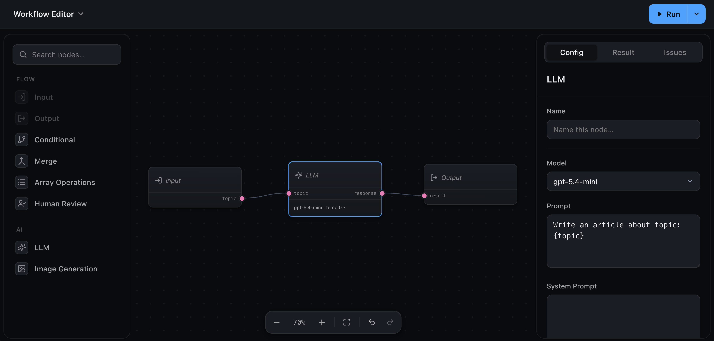

<div align="center">


# Wayflow

**The visual workflow editor you embed, not rebuild.**

[](https://www.npmjs.com/package/wayflow)&nbsp;
[](LICENSE)&nbsp;
[](https://www.npmjs.com/package/wayflow)

</div>

<br />



<br />

Wayflow drops a complete workflow editor into your product. From a single call you
get the canvas, the node palette, the config panel, and the run controls — and
Wayflow _runs_ the workflows your users build, in the browser or on your server.
Powered by AI when you want it, plain logic when you don't.

It's plain TypeScript and the DOM, with no UI framework — so it works the same in
React, Vue, Svelte, or no framework at all.

## Install

```sh
npm install wayflow
```

## Quick start

Point `createWorkflowEditor` at a container, and that one call mounts the whole
editor:

```ts
import { createWorkflowEditor } from 'wayflow'

const editor = createWorkflowEditor(document.getElementById('editor'))
```

That's the editor on screen. To execute a graph, hand it a runtime — the
[Quickstart](https://wayflow.build/docs/getting-started/quickstart) walks you from
install to a running workflow in a few minutes.

## Why Wayflow

- **The whole editor, one call** — canvas, node palette, config panel, and run
  controls. A complete workspace, not a blank canvas you finish yourself.
- **It runs your workflows** — a real execution engine ships in the box.
  Prototype in the browser with no backend, then run the same graph on your server.
- **AI when you want it, logic when you don't** — built-in LLM, tool-calling,
  branching, and map-over-list nodes mix freely with your own deterministic steps.
- **Pause for a human, resume later** — suspend a run for an approval or a
  decision, then pick it right back up. Human-in-the-loop is built in.
- **Bring your own models** — provider-neutral LLM and image adapters. Your keys,
  your vendor — never locked to one.
- **Brand it from one token** — set the accent and every surface, hover, and
  focus ring recomputes. Light and dark stay in sync.

Ships with full TypeScript types, zero runtime dependencies, and a tree-shakeable
package.

## Works with any framework

Wayflow is plain TypeScript and the DOM, so it mounts inside **React**, **Vue**,
**Svelte** — or no framework at all — with a single call. No wrappers, no adapters.

## Documentation

Full docs live at **[wayflow.build](https://wayflow.build)**.

- [Quickstart](https://wayflow.build/docs/getting-started/quickstart) — a running editor in a few minutes
- [Building workflows](https://wayflow.build/docs/building-workflows/node-library) — the built-in nodes and custom node types
- [Running workflows](https://wayflow.build/docs/running-workflows/overview) — the runtime, in the browser or on a server
- [Reference](https://wayflow.build/docs/reference/overview) — the full API

## Examples

The [`examples/`](examples/) folder has focused, runnable apps — a quickstart,
custom nodes, a low-level setup, preview mode, and an editor wired to a backend.

## Contributing

Contributions are welcome — see [CONTRIBUTING.md](CONTRIBUTING.md).

## License

[MIT](LICENSE) © Taha Shashtari
